# Lab 04: Analyze data in a lake database

## Lab Scenario

Azure Synapse Analytics enables you to combine the flexibility of file storage in a data lake with the structured schema and SQL querying capabilities of a relational database through the ability to create a *lake database*. A lake database is a relational database schema defined on a data lake file store that enables data storage to be separated from the compute used to query it. Lake databases combine the benefits of a structured schema that includes support for data types, relationships, and other features typically only found in relational database systems, with the flexibility of storing data in files that can be used independently of a relational database store. Essentially, the lake database "overlays" a relational schema onto files in folders in the data lake.

### Objectives
  
After completing this lab, you will be able to:

+ Task 1: Provision an Azure Synapse Analytics workspace
+ Task 2: Modify container permissions.
+ Task 3: Create a lake database in Synapse Studio.
+ Task 4: Create a table 
+ Task 5: Create a table from a database template.
+ Task 6: Create a table from existing data.
+ Task 7: Work with lake database tables.

### Estimated timing: 90 minutes

### Architecture Diagram

   

## Task 1: Provision an Azure Synapse Analytics workspace

To support a lake database, you need an Azure Synapse Analytics workspace with access to data lake storage. There is no need for a dedicated SQL pool, since you can define the lake database using the built-in serverless SQL pool. Optionally, you can also use a Spark pool to work with data in the lake database.

In this task, you'll use a combination of a PowerShell script and an ARM template to provision an Azure Synapse Analytics workspace.

1. Use the **[\>_]** button to the right of the search bar at the top of the page to create a new Cloud Shell in the **Azure portal**.

    

1. The first time you open the Cloud Shell, you may be prompted to choose the type of shell you want to use (Bash or PowerShell). If so, select PowerShell.

    

    > **Note**: If you have previously created a cloud shell that uses a *Bash* environment, use the the drop-down menu at the top left of the cloud shell pane to change it to ***PowerShell***.

1. On Getting started window choose **Mount storage account(1)** then under Storage account subscription select your available **subscription (2)** from the dropdown and click on **Apply (3)**.

   

1. Within the Mount storage account pane, select **I want to create a storage (1)** and click **Next (2)**.

    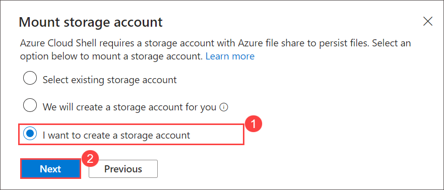

1. Please make sure you have selected your resource group **synapse** and then select any available **Region** and enter unique name for the **Storage account** and for the **File share**, then click on **Create**.

   

1. Cloud Shell can be resized by dragging the separator bar at the top of the pane, or by using the —, **&#9723;**, and **X** icons at the top right of the pane to minimize, maximize, and close the pane. For more information about using the Azure Cloud Shell, see the [Azure Cloud Shell documentation](https://docs.microsoft.com/azure/cloud-shell/overview).

5. In the PowerShell pane, enter the following commands to clone this repo:

    ```
    rm -r synapse -f
    git clone https://github.com/CloudLabsAI-Azure/Data-Analytics-with-Azure-Synapse synapse
    ```

6. After the repo has been cloned, enter the following commands to change to the folder for this exercise and run the **setup.ps1** script it contains:

    ```
    cd synapse/Allfiles/labs/04
    ./setup.ps1
    ```

7. If prompted, choose which subscription you want to use (this will only happen if you have access to multiple Azure subscriptions).

8. When prompted, enter a suitable password to be set for your Azure Synapse SQL pool.

    > **Note**: Be sure to remember this password!

9. Wait for the script to complete - this typically takes around 10 minutes, but in some cases may take longer. While you are waiting, review the [Lake database](https://docs.microsoft.com/azure/synapse-analytics/database-designer/concepts-lake-database) and [Lake database templates](https://docs.microsoft.com/azure/synapse-analytics/database-designer/concepts-database-templates) articles in the Azure Synapse Analytics documentation.

## Task 2: Modify container permissions

In this task, you will be modifying the container permissions to Microsoft Entra User Account.

1. After the deployment script has completed, in the Azure portal, go to the **analyticsxxxxx** resource group that is created, and notice that this resource group contains your Synapse workspace, a Storage account for your data lake, and an Apache Spark pool.


    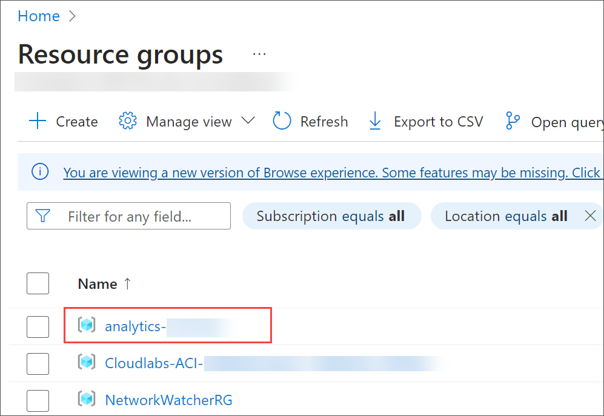
   
3. Select the **Storage account** named **datalakexxxxxxx** 
   
4. Within the **datalakexxxxxx** page, from the left navigation pane expand **Data storage** and select **Container** then click **files** folder.

    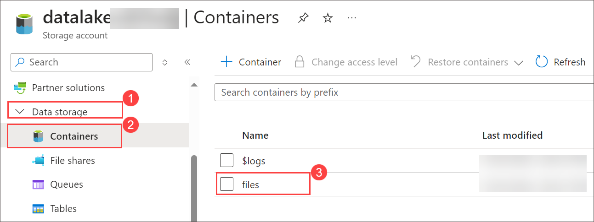

5. Within the **files** folder you'll note the **Authentication method:** is listed as ***Access key (Switch to Microsoft Entra user account)*** click on this to change to Microsoft Entra User Account.

    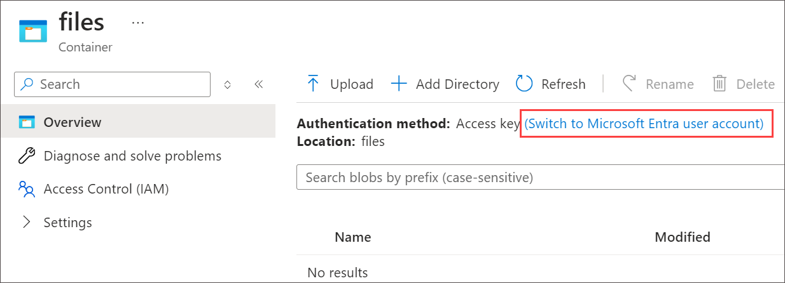

## Task 3: Create a lake database in Synapse Studio

A lake database is a type of database that you can define in your workspace, and work with using the built-in serverless SQL pool.

In this task, you will be creating a lake database with the RetailDB and modify its properties and publish it.

1. Go back to the **analyticsxxxxx** resource group and select your **Synapse workspace**.

     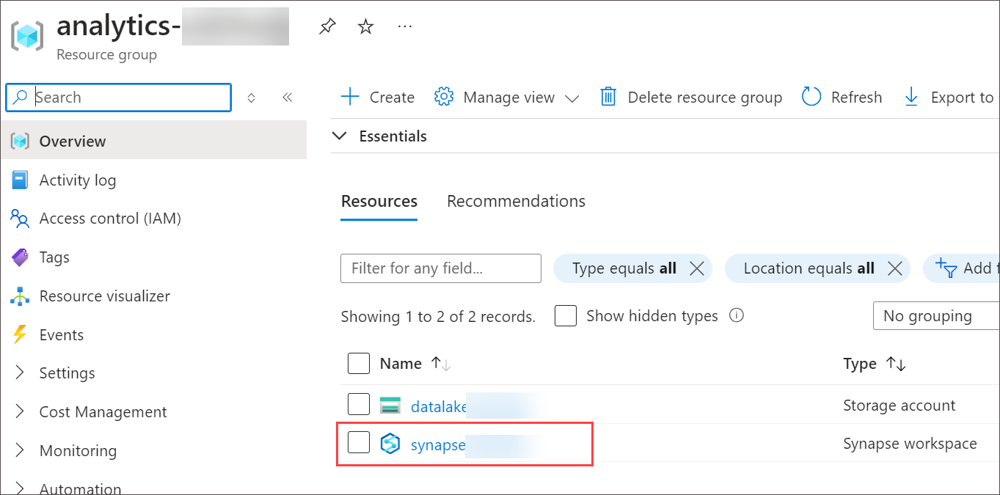

1. In the **Overview page** for your Synapse Workspace, in the **Open Synapse Studio** card, select **Open** to open Synapse Studio in a new browser tab; signing in if prompted.

   .png)

1. On the left side of Synapse Studio, use the **&rsaquo;&rsaquo;** icon to expand the menu - this reveals the different pages within Synapse Studio that you'll use to manage resources and perform data analytics tasks.

      .png)

1. On the **Data** **(1)** page, view the **Linked** **(2)** tab and verify that your workspace includes a link to your **Azure Data Lake Storage Gen2** storage account.

    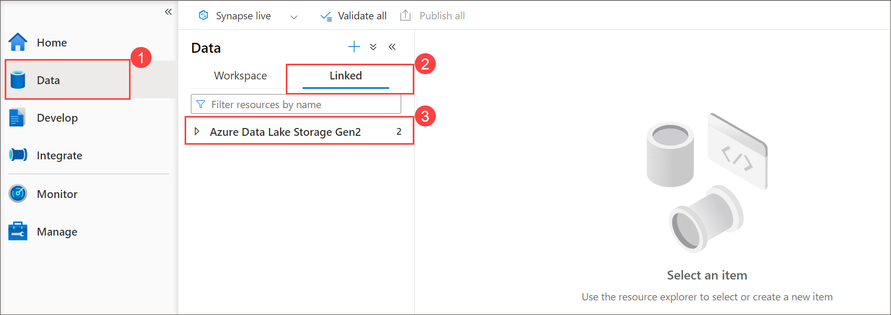

1. On the **Data** page, switch back to the **Workspace** tab and note that there are no databases in your workspace.

     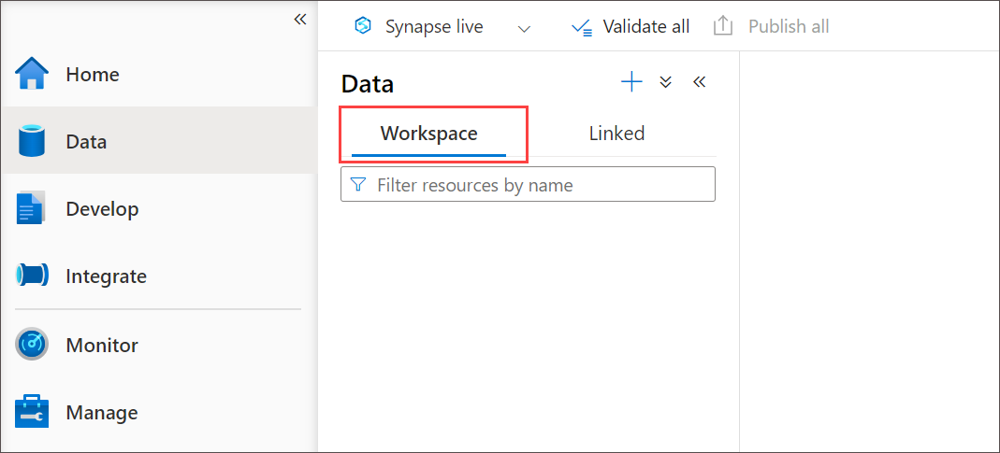
   
1. In the **+ (1)** menu, select **Lake database (2)** to open a new tab in which you can design your database schema (accepting the database templates terms of use if prompted).

   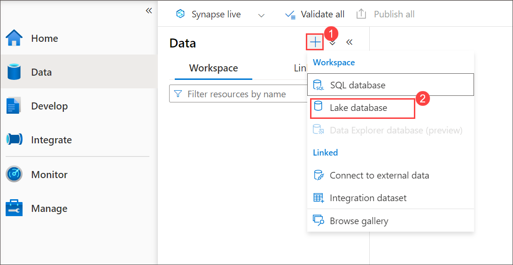

1. In the **Properties** pane for the new database, change the **Name** to **RetailDB** and verify that the **Input folder** property is automatically updated to **files/RetailDB**. Leave the **Data format** as **Delimited Text** (you could also use *Parquet* format, and you can override the file format for individual tables - we'll use comma-delimited data in this exercise.)

   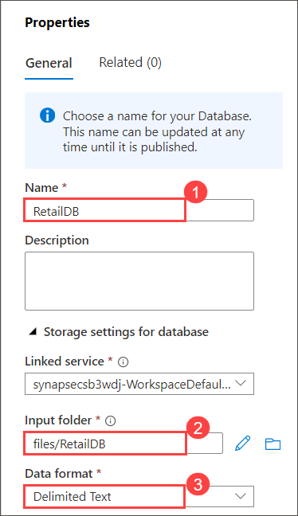

1. At the top of the **RetailDB** pane, select **Publish** to save the database so far.

     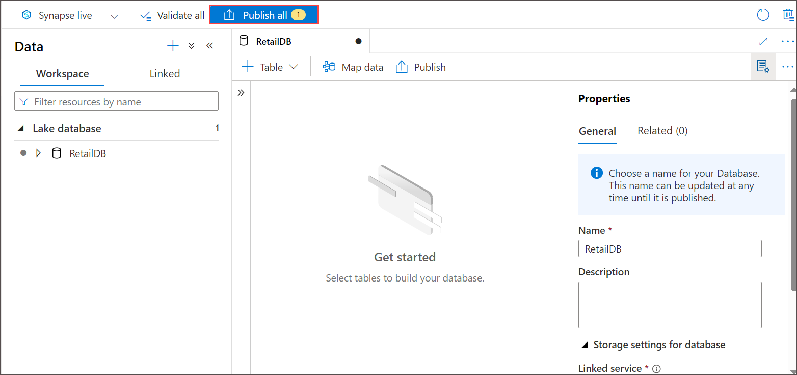

1. On **Publish all** page click on **Publish**.

1. In the **Data** pane on the left, view the **Linked** tab. Then expand **Azure Data Lake Storage Gen2** and the primary **datalake*xxxxxxx*** storage for your **synapse*xxxxxxx*** workspace, and select the **files** file system, which currently contains a folder named **synapse**.

   

1. In the **files** tab that has opened, select **New folder** button to create a new folder named **RetailDB** - this will be the input folder for the data files used by tables in your database.

    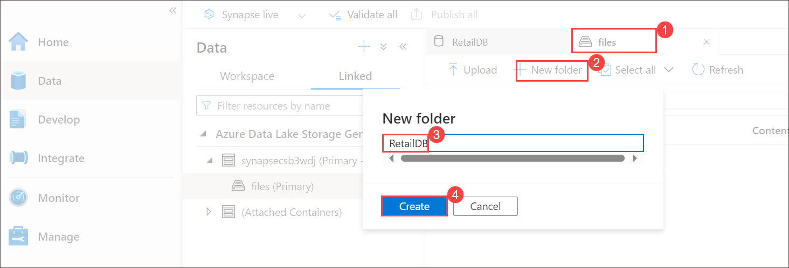

## Task 4: Create a table 

Now that you have created a lake database, you can define its schema by creating tables.

### Task 4.1: Define the table schema

1. Switch back to the **RetailDB** tab for your database definition, and in the **+ Table** list, select **Custom**, and note that a new table named **Table_1** is added to your database.
      

2. With **Table_1** selected, in the **General** tab under the database design canvas, change the **Name** property to **Customer**.

    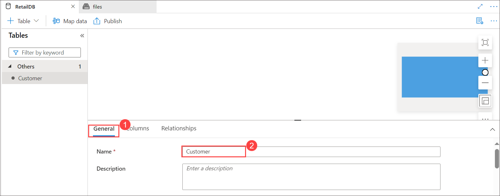


3. Scroll down in the **General** tab, expand the **Storage settings for table** section and note that the table will be stored as delimited text in the **files/RetailDB/Customer** folder in the default data lake store for your Synapse workspace.

    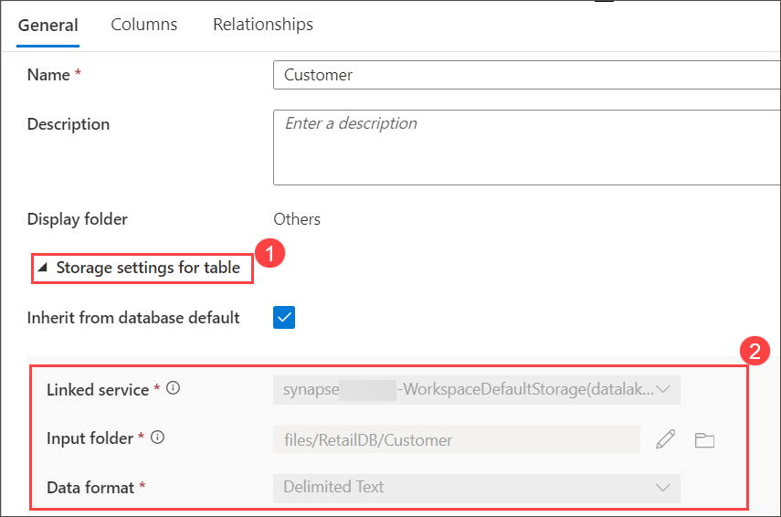

5. On the **Columns** tab, note that by default, the table contains one column named **Column_1**. Edit the column definition to match the following properties:

     - Name CustomerId

     - Key  select **PK**

    - Description **Unique customer ID**

     - Data type **12l Long**

       .png)

4. In the **+ Column** list, select **New column**, and modify the new column definition to add a **FirstName** column to the table as follows:

     

     Name **FirstName**

     Description **Customer first name**

     Data type **abc String**

     .png)

6. Add more new columns until the table definition looks like this:

   | **Name**         | **Description**           | **Description**     | **Data type**                |
   | ---------------  | ------------------------- | --------------------| ---------------------------- |
   |**LastName**      | **Customer last name**    | Check box **Null**  | **abc String**               |
   |**EmailAddress**  | **Customer email**        | Uncheck box **Null**| **abc String**               |
   |**Phone**         | **Customer phone**        | Check box **Null**  | **abc String**               |
   

   .png)

6. When you've added all of the columns, **publish** the database again to save the changes.

     

7. In the **Data** pane on the left, switch back to the **Workspace** tab so you can see the **RetailDB** lake database. Then expand it and refresh its **Tables** folder to see the newly created **Customer** table.

      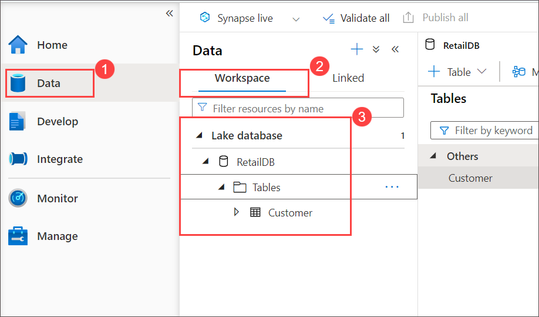

### Task 4.2: Load data into the table's storage path

1. In the main pane, switch back to the **files** tab, which contains the file system with the **RetailDB** folder. Then open the **RetailDB** folder and create a new folder named **Customer** in it. This is where the **Customer** table will get its data.

2. Open the new **Customer** folder, which should be empty.

3. Download the **customer.csv** data file from https://github.com/CloudLabsAI-Azure/Data-Analytics-with-Azure-Synapse/blob/main/Allfiles/labs/04/data/customer.csv and save it in a folder on your local computer (it doesn't matter where). Then in the **Customer** folder in Synapse Explorer, use the **&#10514; Upload** button to upload the **customer.csv** file to the **RetailDB/Customer** folder in your data lake.

    > **Note**: In a real production scenario, you would probably create a pipeline to ingest data into the folder for the table data. We're uploading it directly in the Synapse Studio user interface in this exercise for expediency.

3. In the **Data** pane on the left, on the **Workspace** tab, in the **...** menu for the **Customer** table, select **New SQL script** > **Select TOP 100 rows**. Then, in the new **SQL script 1** pane that has opened, ensure that the **Built-in** SQL pool is connected, and use the **&#9655; Run** button to run the SQL code. The results should include first 100 rows from the **Customer** table, based on the data stored in the underlying folder in the data lake.

4. Close the **SQL script 1** tab, discarding your changes.

## Task 5: Create a table from template

As you've seen, you can create the tables you need in your lake database from scratch. However, Azure Synapse Analytics also provides numerous database templates based on common database workloads and entities that you can use as a starting point for your database schema.

In this task, you will define a schema for the table RetailDB and load the data to it.

### Task 5.1: Define the table schema

1. In the main pane, switch back to the **RetailDB** pane, which contains your database schema (currently containing only the **Customer** table).

2. In the **+ Table** menu, select **From template**. Then in the **Add from template** page, select **Retail** and click **Continue**.

3. In the **Add from template (Retail)** page, wait for the table list to populate, and then expand **Product** and select **RetailProduct**. Then click **Add**. This adds a new table based on the **RetailProduct** template to your database.

4. In the **RetailDB** pane, select the new **RetailProduct** table. Then, in the pane beneath the design canvas, on the **General** tab, change the name to **Product** and verify that the storage settings for the table specify the input folder **files/RetailDB/Product**.

5. On the **Columns** tab for the **Product** table, note that the table already includes a large number of columns inherited from the template. There are more columns than required for this table, so you'll need to remove some.

6. Select the checkbox next to **Name** to select all of the columns, and then <u>un</u>select the following columns (which you need to retain):
    - ProductId
    - ProductName
    - IntroductionDate
    - ActualAbandonmentDate
    - ProductGrossWeight
    - ItemSku
7. On the toolbar in the **Columns** pane, select **Delete** to remove the selected columns. This should leave you with the following columns:

    .png)

8. Add a new column named **ListPrice** to the table as shown here:

    .png)

9. When you've modified the columns as shown above, publish the database again to save the changes.

10. In the **Data** pane on the left, switch back to the **Workspace** tab so you can see the **RetailDB** lake database. Then use the **...** menu for its **Tables** folder to refresh the view and see the newly created **Product** table.

### Task 5.2: Load data into the table's storage path

1. In the main pane, switch back to the **files** tab, which contains the file system, and navigate to the **files/RetailDB** folder, which currently contains the **Customer** folder for the table you created previously.

2. In the **RetailDB** folder, create a new folder named **Product**. This is where the **Product** table will get its data.

3. Open the new **Product** folder, which should be empty.

4. Download the **product.csv** data file from https://github.com/CloudLabsAI-Azure/Data-Analytics-with-Azure-Synapse/blob/main/Allfiles/labs/04/data/product.csv and save it in a folder on your local computer (it doesn't matter where). Then in the **Product** folder in Synapse Explorer, use the **&#10514; Upload** button to upload the **product.csv** file to the **RetailDB/Product** folder in your data lake.

5. In the **Data** pane on the left, on the **Workspace** tab, in the **...** menu for the **Product** table, select **New SQL script** > **Select TOP 100 rows**. Then, in the new **SQL script 1** pane that has opened, ensure that the **Built-in** SQL pool is connected, and use the **&#9655; Run** button to run the SQL code. The results should include first 100 rows from the **Product** table, based on the data stored in the underlying folder in the data lake.

6. Close the **SQL script 1** tab, discarding your changes.

## Task 6: Create a table from existing data

So far, you've created tables and then populated them with data. In some cases, you may already have data in a data lake from which you want to derive a table.

In this task, you will use an existing data which is already present and create a table and import this data to that table.

### Task 6.1: Upload data

1. In the main pane, switch back to the **files** tab, which contains the file system, and navigate to the **files/RetailDB** folder, which currently contains the **Customer** and **Product** folders for the tables you created previously.

2. In the **RetailDB** folder, create a new folder named **SalesOrder**.

3. Open the new **SalesOrder** folder, which should be empty.

4. Download the **salesorder.csv** data file from https://github.com/CloudLabsAI-Azure/Data-Analytics-with-Azure-Synapse/blob/main/Allfiles/labs/04/data/salesorder.csv and save it in a folder on your local computer (it doesn't matter where). Then in the **SalesOrder** folder in Synapse Explorer, use the **&#10514; Upload** button to upload the **salesorder.csv** file to the **RetailDB/SalesOrder** folder in your data lake.

### Task 6.2: Create a table

In this task, you will create a table SalesOrder from data lake and verify it. 

1. In the main pane, switch back to the **RetailDB** pane, which contains your database schema (currently containing the **Customer** and **Product** tables).
2. In the **+ Table** menu, select **From data lake**. Then in the **Create external table from data lake** pane, specify the following options:
    - **External table name**: SalesOrder
    - **Linked service**: Select **synapse*xxxxxxx*-WorkspaceDefautStorage(datalake*xxxxxxx*)**
    - **Input file of folder**: files/RetailDB/SalesOrder
3. Continue to the next page and then create the table with the following options:
    - **File type**: CSV
    - **Field terminator**: Default (comma ,)
    - **First row**: Leave *infer column names* <u>un</u>selected.
    - **String delimiter**: Default (Empty string)
    - **Use default type**: Default type (true,false)
    - **Max string length**: 4000

4. When the table has been created, note that it includes columns named **C1**, **C2**, and so on and that the data types have been inferred from the data in the folder. Modify the column definitions as follows:

    .png)
    > **Note**: The table contains a record for each individual item ordered, and includes a composite primary key comprised of **SalesOrderId** and **LineItemId**.

5. On the **Relationships** tab for the **SalesOrder** table, in the **+ Relationship** list, select **To table**, and then define the following relationship:

    .png)

6. Add a second *To table* relationship with the following settings:

    .png)

    The ability to define relationships between tables helps enforce referential integrity between related data entities. This is a common feature of relational databases that would otherwise be difficult to apply to files in a data lake.

7. Publish the database again to save the changes.

8. In the **Data** pane on the left, switch back to the **Workspace** tab so you can see the **RetailDB** lake database. Then use the **...** menu for its **Tables** folder to refresh the view and see the newly created **SalesOrder** table.

## Task 7: Work with lake database tables

Now that you have some tables in your database, you can use them to work with the underlying data.

In this task, you will be querying these tables using SQL scripts and also you will be inserting data using notebooks.

### Task 7.1: Query tables using SQL

1. In Synapse Studio, select the **Develop** page.

2. In the **Develop** pane, in the **+** menu, select **SQL script**.

3. In the new **SQL script 1** pane, ensure the script is connected to the **Built-in** SQL pool and in the **User database** list, select **RetailDB**.

4. Enter the following SQL code:

    ```sql
    SELECT o.SalesOrderID, c.EmailAddress, p.ProductName, o.Quantity
    FROM SalesOrder AS o
    JOIN Customer AS c ON o.CustomerId = c.CustomerId
    JOIN Product AS p ON o.ProductId = p.ProductId
    ```

5. Use the **&#9655; Run** button to run the SQL code.

    The results show order details with customer and product information.

6. Close the **SQL script 1** pane, discarding your changes.

### Task 7.2: Insert data using Spark

In this task, you will be inserting data in to the table using notebook attached to the Spark.

1. In the **Develop** pane, in the **+** menu, select **Notebook**.

2. In the new **Notebook 1** pane, select the dropdown beside **Attach to** and select **spark*xxxxxxx**** Spark pool.

3. Enter the following code in the empty notebook cell:

    ```
    %%sql
    INSERT INTO `RetailDB`.`SalesOrder` VALUES (99999, CAST('2022-01-01' AS TimeStamp), 1, 6, 5, 1)
    ```

4. Use the **&#9655;** button on the left of the cell to run it and wait for it to finish running. Note that it will take some time to start the Spark pool.

5. Use the **+ Code** button to add a new cell to the notebook.

    > **Note**: If the **+ Code** option isn't visible, try hovering your mouse cursor below the results to reveal it.

6. Enter the following code in the new cell:

    ```
    %%sql
    SELECT * FROM `RetailDB`.`SalesOrder` WHERE SalesOrderId = 99999
    ```
7. Use the **&#9655;** button on the left of the cell to run it and verify that a row for sales order 99999 was inserted into the **SalesOrder** table.

8. Close the **Notebook 1** pane, stopping the Spark session and discarding your changes.

   <validation step="c7c2a4b7-1b09-4a42-a89c-255c051ca4e4" />

  **Congratulations** on completing the lab! Now, it's time to validate it. Here are the steps:

  > - Navigate to the Lab Validation tab, from the upper right corner in the lab guide section.
  > - Hit the Validate button for the corresponding task. If you receive a success message, you have successfully validated the lab. 
  > - If not, carefully read the error message and retry the step, following the instructions in the lab guide.
  > - If you need any assistance, please contact us at labs-support@spektrasystems.com.   

## Summary

In this lab, you have successfully modified container permissions within a Storage account, created a lake database in Synapse Studio, and built tables using both database templates and existing data. Additionally, you worked with lake database tables, gaining hands-on experience in managing and utilizing structured data within a Synapse environment.

## Review

In this lab, you have accomplished the following:
- Modify container permissions in the Stroage account
- Create a lake database in Synapse Studio
- Create a table from a database template
- Create a table from existing data
- Work with lake database tables

## You have successfully completed the lab.
